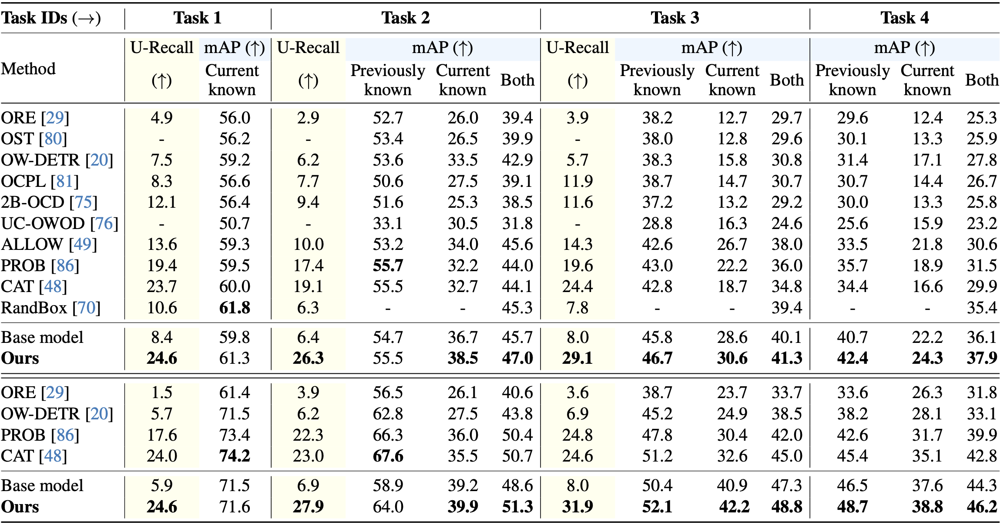

# OrthogonalDet
Code for CVPR 2024 paper "Exploring Orthogonality in Open World Object Detection".

## Requirements
- Linux or macOS with Python ≥ 3.8.
- Install [PyTorch ≥ 1.9.0, torchvision](https://pytorch.org/#install),
  [Detectron2](https://detectron2.readthedocs.io/en/latest/tutorials/install.html),
  timm, and einops.
- Prepare datasets:
  - Download [COCO](https://cocodataset.org/#download) and [PASCAL VOC](http://host.robots.ox.ac.uk/pascal/VOC/).
  - Convert annotation format using `coco_to_voc.py`.
  - Move all images to `datasets/JPEGImages` and annotations to `datasets/Annotations`.

## Getting Started
* Training for open world object detection:
  ```
  bash run_owod.sh
  ```
  Evaluation for open world object detection:
  ```
  bash test_owod.sh
  ```
* Experiment for incremental object detection:
  ```
  bash run_iod.sh
  ```
* Visualize the results:
  ```
  python demo.py -i LIST_OF_IMAGES
  ```

## Results
The following results were obtained with four NVIDIA 2080 Ti GPUs, using the checkpoints at [this link](https://drive.google.com/drive/folders/1XTTmjC_oVA2-J8l-bBdBo9nrQVq-lgKm).



## Acknowledgement

Our implementation is based on [RandBox](https://github.com/scuwyh2000/RandBox) which uses [Detectron2](https://github.com/facebookresearch/detectron2) and [Sparse R-CNN](https://github.com/PeizeSun/SparseR-CNN).
